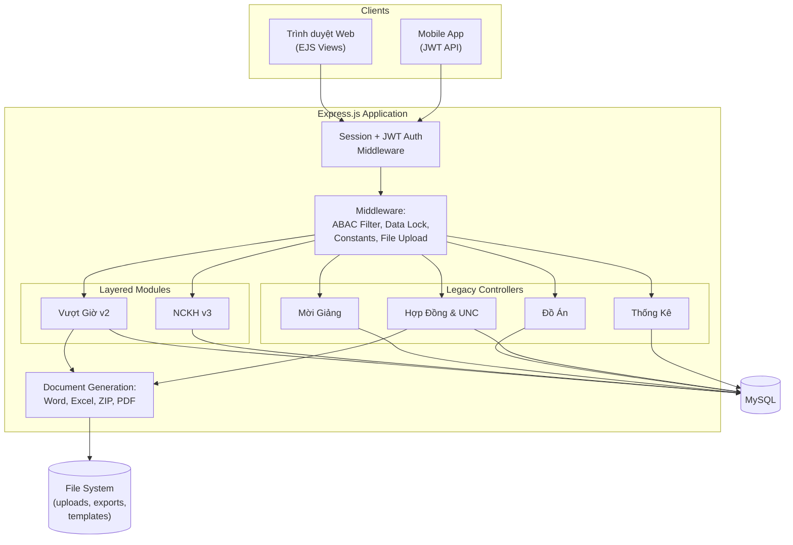

# Hệ thống Quản lý Công tác Giảng dạy & NCKH — Học viện Kỹ thuật Mật mã

> **TTCS** là ứng dụng web nội bộ dùng để quản lý toàn bộ khối lượng giảng dạy, nghiên cứu khoa học, hợp đồng mời giảng và hướng dẫn đồ án tốt nghiệp tại Học viện Kỹ thuật Mật mã. Hệ thống phục vụ giảng viên, giáo vụ cấp khoa, Phòng Đào tạo, Phòng Tài chính và Viện NCKH&HTPT — tự động hóa việc tổng hợp số giờ, tính toán vượt giờ, trừ giờ NCKH, phê duyệt nhiều cấp, khóa dữ liệu theo kỳ tài chính, và kết xuất hợp đồng Word / báo cáo Excel / ủy nhiệm chi phục vụ chi trả lương.

---

## Mục lục

- [Các tính năng chính](#các-tính-năng-chính)
- [Công nghệ sử dụng](#công-nghệ-sử-dụng)
- [Kiến trúc hệ thống](#kiến-trúc-hệ-thống)
- [Cấu trúc thư mục](#cấu-trúc-thư-mục)
- [Cài đặt & Phát triển](#cài-đặt--phát-triển)
- [Biến môi trường](#biến-môi-trường)
- [Các lệnh có sẵn](#các-lệnh-có-sẵn)
- [Module chi tiết](#module-chi-tiết)
- [Xác thực & Phân quyền](#xác-thực--phân-quyền)
- [Đồng bộ dữ liệu](#đồng-bộ-dữ-liệu)
- [Hạn chế & Nợ kỹ thuật](#hạn-chế--nợ-kỹ-thuật)

---

## Các tính năng chính

### Tổng hợp khối lượng & Tính toán vượt giờ (`vuotgio_v2`)

- Nhập và quản lý **Lớp Ngoài Quy Chuẩn** (LNQC) — hỗ trợ nhập tay, import Excel, và quy trình duyệt từng bản ghi.
- Nhập và quản lý **Kết Thúc Học Phần** (KTHP) — coi thi, chấm thi, ra đề thi — từ file Excel hoặc form.
- Nhập **Hướng Dẫn Tham Quan Thực Tế** với phê duyệt theo batch.
- **Tổng hợp theo Giảng viên & theo Khoa**: tự động tính toán giờ giảng dạy chuẩn, giờ vượt, trừ giờ NCKH thiếu, áp dụng ngưỡng 300 giờ.
- **Xuất file Excel** theo 3 cấp: Bảng kê khai từng khoa, Bảng tổng hợp toàn trường, và Bảng chuyển khoản.
- **Khóa dữ liệu** theo năm học — middleware `checkDataLock` chặn mọi thao tác ghi sau khi kỳ tài chính đã chốt (fail-closed).
- **Phê duyệt tổng hợp** theo chuỗi: Khoa → Phòng Đào tạo, với kiểm tra tiên quyết trước khi duyệt.
- **Preview** giờ giảng chi tiết theo giảng viên, theo khoa, và tổng hợp liên khoa trước khi xuất.

### Quản lý Nghiên cứu khoa học (`nckh_v3`)

- Quản lý **8 loại hình NCKH**: Đề tài/Dự án, Bài báo Khoa học, Sáng kiến, Giải thưởng, Đề xuất Nghiên cứu, Sách/Giáo trình, Hướng dẫn SV NCKH, Thành viên Hội đồng.
- Mỗi loại hình có **CRUD API riêng** với metadata, danh sách và chi tiết.
- **Hệ thống phân bổ điểm NCKH** giữa các tác giả (qua `formula.service.js`).
- **Phê duyệt 2 cấp**: cấp Khoa (`khoa-duyet`) và cấp Viện NCKH (`vien-duyet`), hỗ trợ duyệt hàng loạt (`bulk-approvals`).
- **Cấu hình quy định** số giờ NCKH theo năm học (Admin UI tại `/v3/nckh/admin/quy-dinh`).
- **Import NCKH từ Excel** — giới hạn quyền cho Trợ lý/Lãnh đạo Viện NCKH.
- **Thống kê & xuất báo cáo** theo 3 cấp: Giảng viên, Khoa, Toàn Học viện — dạng JSON API hoặc Excel.

### Quy trình Mời giảng (Legacy)

- Đăng ký giảng viên thỉnh giảng (gvmoi), quản lý thông tin cá nhân và CCCD.
- Nhập bảng phân công lớp dạy, chuẩn hóa khối lượng theo hệ đào tạo (ĐH/CH/NCS) bằng hệ số quy đổi.
- **Vòng đời phê duyệt**: Chờ duyệt → Đã duyệt → Ngừng dạy, với danh sách riêng từng trạng thái.
- Tạo **Hợp đồng Word** tự động (docxtemplater) từ template `.docx` cho từng hệ đào tạo.
- **Đánh số hợp đồng** và **duyệt hợp đồng** theo quy trình Đào tạo → Tài chính.

### Hướng dẫn Đồ án tốt nghiệp (Legacy)

- Phân công hướng dẫn với quản lý theo đợt/kỳ/năm học.
- Tính toán phân bổ giờ hướng dẫn theo quy tắc cứng (ví dụ: 20/12/8 giờ cho 1 hoặc nhiều người hướng dẫn).
- Tạo hợp đồng đồ án và phụ lục hợp đồng.

### Xuất tài liệu Tài chính

- **Hợp đồng Word** (`.docx`): từ 6 template (HP, CH, MM, NCS, DA, DA Cao học) + đóng gói ZIP.
- **Phụ lục hợp đồng** và **Minh chứng GVM**.
- **Ủy nhiệm chi** (UNC): xuất từ template Excel, hỗ trợ import dữ liệu ngoài và tải hàng loạt.
- **Báo cáo Excel tổng hợp** cho mời giảng và đồ án.

### Quản trị hệ thống

- CRUD danh mục: Nhân viên, Phòng ban, Bộ môn, Năm học, Hệ đào tạo, Phòng học/Tòa nhà, Tài khoản.
- Quản lý quy chuẩn giảng dạy, phần trăm miễn giảm, hệ số lớp đông, tiền lương/chức danh.
- Import TKB (Thời Khóa Biểu) từ Excel.
- **Backup/Restore** cơ sở dữ liệu.
- **Đồng bộ dữ liệu** giữa các instance (Export → Import qua JSON, với conflict resolution theo natural key).
- **Nhật ký thay đổi** (`lichsunhaplieu`) — ghi lại mọi thao tác thêm/sửa/xóa.

---

## Công nghệ sử dụng

| Lớp | Công nghệ |
|---|---|
| **Frontend** | EJS (server-side rendering), Bootstrap 5, jQuery, jQuery UI |
| **Backend** | Node.js, Express.js |
| **Cơ sở dữ liệu** | MySQL (mysql2/promise — raw SQL, connection pool) |
| **Xác thực** | Express Session + JWT (access token 15 phút, refresh token 30 ngày), bcrypt (auto-migrate plaintext → hash) |
| **Tạo tài liệu** | docxtemplater + PizZip (Word), ExcelJS + xlsx (Excel), Archiver (ZIP), libreoffice-convert (PDF) |
| **Upload** | Multer (disk + memory storage) |
| **Tooling** | nodemon (dev), dotenv |

---

## Kiến trúc hệ thống

Ứng dụng là một **monolith Node.js/Express** với kiến trúc **lai (hybrid)**:

- **Module mới** (`vuotgio_v2`, `nckh_v3`): kiến trúc phân lớp rõ ràng  
  `Route → Controller → Service → Repository → MySQL`  
  với Mapper, Validator, và middleware chuyên biệt (ABAC filter, data lock).

- **Module cũ** (Mời giảng, Đồ án, Hợp đồng, Import, Thống kê): kiến trúc **controller-centric**  
  — Controller chứa trực tiếp raw SQL, logic nghiệp vụ và render view.



---

## Cấu trúc thư mục

```
ttcs/
├── src/
│   ├── server.js                  # Entry point, route registration, auth middleware
│   ├── config/
│   │   ├── databasePool.js        # MySQL connection pool (mysql2/promise)
│   │   ├── Pool.js                # Legacy pool wrapper
│   │   ├── viewEngine.js          # EJS + static file config
│   │   ├── syncConfig.js          # Data sync rules per table
│   │   ├── vuotgio_v2/            # Overtime module config
│   │   └── nckh_v3/               # Research module config (types registry)
│   ├── controllers/
│   │   ├── vuotgio_v2/            # 15 controllers — layered pattern
│   │   ├── nckh_v3/               # 15 controllers — layered pattern
│   │   └── *.js                   # 55 legacy controllers (monolithic)
│   ├── services/
│   │   ├── vuotgio_v2/            # 14 services + excel/, department_excel/
│   │   ├── nckh_v3/               # 15 services
│   │   └── *.js                   # 5 legacy services
│   ├── repositories/
│   │   ├── vuotgio_v2/            # 9 repository files
│   │   └── nckh_v3/               # 7 repository files
│   ├── mappers/
│   │   ├── vuotgio_v2/            # 5 mappers (LNQC, KTHP, summary, etc.)
│   │   └── nckh_v3/               # 3 mappers (import, response, stats)
│   ├── validators/
│   │   └── nckh_v3/               # 2 validators (approval, typeInput)
│   ├── middlewares/
│   │   ├── khoaFilterMiddleware.js # ABAC: ép filter theo khoa
│   │   ├── dataLockMiddleware.js   # Chặn ghi khi dữ liệu đã khóa
│   │   ├── jwtMiddleware.js        # JWT verification
│   │   ├── constantsMiddleware.js  # Inject roles & departments vào EJS
│   │   └── ...                     # Upload, sync auth, etc.
│   ├── routes/                     # 53 route files
│   ├── views/
│   │   ├── vuotgio_v2/             # 14 EJS templates
│   │   ├── nckh_v3/                # 8 EJS templates
│   │   └── *.ejs                   # ~98 legacy templates
│   ├── templates/                  # Word/Excel templates
│   │   ├── HopDong*.docx           # 6 contract templates
│   │   ├── vuot-gio/               # Overtime Excel template
│   │   └── uy-nhiem-chi/           # Payment order Excel templates
│   ├── queries/                    # Shared SQL queries
│   ├── helpers/                    # Schema validator
│   ├── utils/                      # Log change tracker
│   └── public/                     # CSS, JS, images, exports
├── Giang_Vien_Moi/                 # File storage: guest lecturer docs (CCCD, etc.)
├── uploads/                        # General file uploads
├── backups/                        # Database backup files
├── docs/                           # Business workflow documentation
├── package.json
├── .env
└── .gitignore
```

---

## Cài đặt & Phát triển

### Yêu cầu hệ thống

- **Node.js** v14+ (khuyến nghị v16+)
- **MySQL** Server (v5.7+ hoặc v8)
- **LibreOffice** (nếu cần chuyển đổi Word → PDF qua `libreoffice-convert`)

### Hướng dẫn cài đặt

1. **Clone repository:**
   ```bash
   git clone https://github.com/trongnghia6/fenckh.git
   cd fenckh
   ```

2. **Cài đặt dependencies:**
   ```bash
   npm install
   ```

3. **Tạo cơ sở dữ liệu MySQL:**
   ```sql
   CREATE DATABASE ttcs CHARACTER SET utf8mb4 COLLATE utf8mb4_unicode_ci;
   ```
   > **Lưu ý:** Dự án không sử dụng migration tự động. Schema cần được khôi phục từ bản backup hoặc thiết lập thủ công.

4. **Cấu hình biến môi trường:** Tạo file `.env` ở thư mục gốc (xem [Biến môi trường](#biến-môi-trường)).

5. **Chạy server:**
   ```bash
   npm start
   ```
   Server sẽ khởi chạy tại `http://localhost:3000` (hoặc port bạn đã cấu hình).

---

## Biến môi trường

Tạo file `.env` tại thư mục gốc với các biến sau:

```env
NODE_ENV=development

# Server
PORT=3000

# Database
DB_HOST=localhost
DB_PORT=3306
DB_USER=root
DB_PASSWORD=<mật-khẩu-db>
DB_NAME=ttcs

# Bảng phụ trợ (dùng trong legacy import)
DB_TABLE_TAM=tam
DB_TABLE_QC=quychuan

# Upload
ALLOWED_FILE_EXTENSIONS=jpg,JPG,jpeg,JPEG,png,PNG,gif,GIF,jfif,pdf,PDF,doc,DOC,docx,DOCX

# JWT
JWT_SECRET=<jwt-secret>

# ── Role constants (dùng trong RBAC/ABAC) ──
ROLE_PHONGBAN_TROLY=Trợ lý
ROLE_PHONGBAN_THUONG=Thường
ROLE_PHONGBAN_LANHDAO=Lãnh đạo phòng
ROLE_KHOA_LANHDAO=Lãnh đạo khoa
ROLE_KHOA_GV_CNBM=GV_CNBM
ROLE_KHOA_GV=GV

# ── Department codes (dùng trong ABAC filter) ──
DAO_TAO=DAOTAO
VAN_PHONG=VP
BAN_GIAM_DOC=BGĐ
KHAO_THI=KT&ĐBCL
VIEN_NCKH_HTPT=NC&HTPT
CONG_NGHE_THONG_TIN=CNTT
AN_TOAN_THONG_TIN=ATTT
DIEN_TU_VI_MACH=ĐTVM
CO_BAN=CB
MAT_MA=MM
PHAN_HIEU_HOC_VIEN=ĐTPH
```

---

## Các lệnh có sẵn

| Lệnh | Mô tả |
|---|---|
| `npm start` | Chạy server với **nodemon** (auto-reload khi code thay đổi) |
| `npm test` | Chạy test với Node.js test runner (`node --test`) |

---

## Module chi tiết

### Vượt Giờ v2 — `/v2/vuotgio/*`

Module phân lớp quản lý tính toán giờ vượt chuẩn:

| Sub-module | Route prefix | Mô tả |
|---|---|---|
| Lớp Ngoài QC | `/v2/vuotgio/lop-ngoai-quy-chuan/*` | CRUD, import Excel, duyệt/hủy duyệt từng bản ghi |
| Kết Thúc HP | `/v2/vuotgio/them-kthp/*`, `/v2/vuotgio/import-kthp/*` | Nhập coi/chấm/ra đề thi |
| Tổng Hợp | `/v2/vuotgio/tong-hop/*` | Tổng hợp giờ theo GV & khoa, preview, duyệt |
| Xuất File | `/v2/vuotgio/xuat-file/*` | Xuất Excel theo khoa, tổng hợp toàn trường |
| Hướng Dẫn ĐATN | `/v2/vuotgio/huong-dan-datn/*` | Giờ hướng dẫn đồ án (read-only tổng hợp) |
| Hướng Dẫn Tham Quan | `/v2/vuotgio/huong-dan-tham-quan/*` | Nhập giờ đi thực tế |
| Khóa Dữ Liệu | `/v2/vuotgio/tong-hop/khoa-du-lieu` | Khóa/mở năm học |

### NCKH v3 — `/v3/nckh/*`

Module phân lớp quản lý nghiên cứu khoa học:

| Sub-module | Route | Mô tả |
|---|---|---|
| 8 loại NCKH | `/v3/nckh/{type}/*` | CRUD cho từng loại (đề tài, bài báo, sáng kiến...) |
| Records (unified) | `/v3/nckh/records/*` | Danh sách chung, duyệt hàng loạt, filter |
| Thống kê | `/v3/nckh/stats/*` | Tổng hợp theo GV / Khoa / Học viện |
| Export | `/v3/nckh/export/*` | Xuất Excel thống kê |
| Import | `/v3/nckh/import/*` | Import từ Excel (restricted quyền Viện NC) |
| Admin Quy Định | `/v3/nckh/admin/quy-dinh` | Cấu hình số giờ NCKH theo năm |

### Legacy Modules

| Module | Controller chính | Mô tả |
|---|---|---|
| **Mời Giảng** | `createGvmController`, `gvmListController`, `updateGvmController`, `moiGiangQCDKController` | Đăng ký GVM, phân lớp, chuẩn hóa quy đổi giờ |
| **Đồ Án** | `doAnChinhThucController`, `chinhSuaDoAnController`, `hopDongDAController` | Quản lý ĐATN theo đợt, phân bổ giờ HD |
| **Hợp Đồng** | `exportHDController` (99KB), `phuLucHDController`, `hopdong.soHopDongController` | Tạo Word từ template, đánh số, duyệt, đóng ZIP |
| **Ủy Nhiệm Chi** | `uyNhiemChiController` (76KB) | Xuất UNC từ template Excel, import dữ liệu ngoài |
| **Import** | `importController` (118KB) | Import hàng loạt TKB, điểm, danh mục |
| **Sync** | `syncController` (73KB) | Export/Import JSON giữa các instance |
| **Thống Kê** | `thongketonghopController`, `thongkevuotgioController`, etc. | Dashboard thống kê tổng hợp |

---

## Xác thực & Phân quyền

### Xác thực (Authentication)

- **Web (EJS):** Express Session với cookie `maxAge = 1 giờ`, rolling refresh. Khi session hết hạn, tự động fallback sang JWT từ HttpOnly cookie.
- **Mobile/API:** JWT Bearer token (access token 15 phút, refresh token 30 ngày lưu trong DB bảng `refresh_tokens`).
- **Mật khẩu:** bcrypt hash, với **auto-migration** plaintext → bcrypt hash tại thời điểm đăng nhập đầu tiên.

### Phân quyền (Authorization)

Hệ thống sử dụng kết hợp **RBAC** và **ABAC**:

**RBAC — Vai trò (Role-based):**
| Vai trò | Quyền |
|---|---|
| `ADMIN` | Toàn quyền quản trị hệ thống |
| `Lãnh đạo phòng` | Quản lý cấp phòng ban (Đào tạo, Tài chính, Viện NC) |
| `Trợ lý` (phòng) | Thao tác dữ liệu cấp phòng ban |
| `Lãnh đạo khoa` | Quản lý cấp khoa, duyệt dữ liệu |
| `GV_CNBM` | Giảng viên chủ nhiệm bộ môn |
| `GV` | Giảng viên, quyền xem hạn chế |

**ABAC — Cách ly dữ liệu theo Khoa (`khoaFilterMiddleware`):**
- User có `isKhoa = 1` bị **ép filter** tự động: mọi param/query/body chứa `Khoa` đều bị ghi đè bằng `MaPhongBan` của user.
- Middleware `verifyRecordBelongsToKhoa` kiểm tra quyền thao tác trên từng bản ghi cụ thể trước khi edit/delete.
- User cấp Phòng (không phải khoa) có thể xem dữ liệu cross-khoa.

**Data Lock (`dataLockMiddleware`):**
- Chặn mọi thao tác **POST/PUT/DELETE** khi năm học đã bị khóa.
- Cho phép **GET** đi qua bình thường.
- **Fail-closed**: lỗi DB hoặc thiếu `namHoc` → trả về 400/500.

---

## Đồng bộ dữ liệu

Hệ thống hỗ trợ **Export/Import dữ liệu** giữa các instance (ví dụ: từ server staging sang production) qua module Sync:

- **Route:** `/sync/*`
- **Cấu hình:** `src/config/syncConfig.js` — định nghĩa natural key, table type (`master`, `business`, `employee`, `teacher`, `research`, `salary`, `contract`, `schedule`, `temporary`), và export query cho từng bảng.
- **Quy trình:** Export toàn bộ → tải file JSON → Import vào instance đích, sử dụng conflict resolution theo unique key (UPSERT).
- Có hỗ trợ `preserveId` cho bảng master có FK references.

---

## Hạn chế & Nợ kỹ thuật

- **Controller nguyên khối (Legacy):** Một số controller cốt lõi (`importController` — 118KB, `exportHDController` — 100KB, `moiGiangQCDKController` — 97KB) chứa hỗn hợp routing, raw SQL interpolation và logic nghiệp vụ trong cùng một file, gây khó bảo trì.
- **Không có ORM hoặc migration:** Toàn bộ truy cập DB qua raw SQL (mysql2/promise). Schema được quản lý thủ công, không có migration files.
- **Quy tắc hardcoded:** Một số quy tắc nghiệp vụ (phân bổ giờ đồ án, hệ số quy đổi hệ đào tạo) bị rải rác ở nhiều controller thay vì tập trung tại một nơi.
- **Session secret cố định:** `express-session` sử dụng secret hardcoded (`"your-secret-key"`) trong code, nên thay bằng biến môi trường.
- **Phân quyền không đồng nhất:** Module mới (`vuotgio_v2`) sử dụng middleware ABAC + data lock nhất quán. Module cũ kiểm tra quyền inline trong controller, thiếu tính đồng nhất.
- **Không có CI/CD, Docker, hoặc test tự động:** Repository không có Dockerfile, docker-compose, hay pipeline CI/CD. Test runner được khai báo nhưng không có test files trong repository.
- **Thiếu rate limiting & CORS production:** CORS được bật `origin: true` (cho phép tất cả), không có rate limiting.

---

## License

ISC
