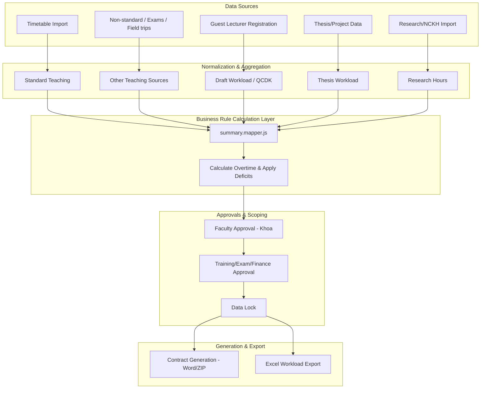

# Academic Workload Management System — As-Is Overview

## 1. What this system actually does
The TTCS system is a university-internal backend application designed to manage academic workload and compensation. It handles:
- **Workload Aggregation:** Collecting and normalizing teaching, exam, non-standard class, field-trip, and project supervision hours.
- **Overtime Calculation:** Applying quotas, exemptions, and NCKH (research) deficits to compute payable overtime.
- **Research Compensation (NCKH):** Importing, distributing, and calculating research workload points across authors.
- **Invited Lecturer Workflows (Mời Giảng):** Managing registration, profiling, and workload normalization for external guest lecturers.
- **Project/Thesis Supervision (Đồ Án):** Assigning supervisors and allocating workload distributions.
- **Contract & Export Generation:** Automatically generating Word contracts (via docxtemplater), Excel reports, and ZIP archives.
- **Access Control & Approval:** Multi-level approval gating and Attribute-Based Access Control (ABAC) to enforce department-level data isolation.

## 2. Architecture reality
The system is built as a **Node.js + Express + EJS + MySQL** monolithic application. All database interactions rely on raw, hand-written SQL rather than an ORM.

Crucially, the architecture is split into two distinct paradigms:
- **Layered Modules (e.g., `vuotgio_v2`, `nckh_v3`):** These newer modules loosely follow an MVC-inspired layered architecture (Route → Controller → Service → Repository/Mapper). Business logic is generally separated into mappers and services, while database access is handled by repositories using connection pools or RAII-style wrappers (`withConnection`).
- **Controller-Centric Legacy Modules (e.g., Mời Giảng, Đồ Án, ExportHD):** These are older, monolithic implementations. They do not employ service or repository layers. Instead, the controllers act as "god functions" that tightly couple request validation, file parsing, business rule execution, ad-hoc access control scoping, and inline bulk SQL execution (often via dynamic string interpolation).

## 3. High-level business flow

*(Note: Data flows vary slightly per module, but generally move from raw entry to normalized calculation, gated by approvals, culminating in document generation.)*

## 4. Main domain modules

| Domain Module | Purpose | Architecture Style | Key Files/Docs | Main Business Rules |
|---------------|---------|-------------------|----------------|---------------------|
| **Vượt giờ** (Overtime) | Aggregate workload and calculate payable overtime. | Layered (Service/Repo/Mapper) | `tongHop.service.js`, `summary.mapper.js`, [workload-aggregation.md](./workload-aggregation.md) | Overtime capped by adjusted quota; NCKH deficit penalizes teaching overtime. |
| **NCKH** (Research) | Import, distribute, and track research workload. | Layered (Service/Repo) | `formula.service.js`, [nckh-compensation.md](./nckh-compensation.md) | Hours distributed via `standard`, `equal`, or `fixed` modes. Overrides Excel inputs. |
| **Mời Giảng** (Invited Lecturer) | Register guests and normalize workload. | Controller-Centric Legacy | `createGvmController.js`, `moiGiangQCDKController.js`, [invited-lecturer-workflow.md](./invited-lecturer-workflow.md) | `QuyChuan = LL * HeSoLopDong * HeSoT7CN`; String-match multiplier (ĐH/CH/NCS). |
| **Đồ Án** (Thesis Supervision) | Assign thesis supervisors and allocate workload. | Controller-Centric Legacy | `doAnChinhThucController.js`, [project-supervision-workflow.md](./project-supervision-workflow.md) | The 20/12/8 hour allocation rule based on supervisor count. |
| **ExportHD** (Contract Generation) | Generate guest lecturer contracts/appendices. | Controller-Centric Legacy | `exportHDController.js`, [contract-generation.md](./contract-generation.md) | Template selection based on `(loai_hinh, cap_do)`. Tax pre-computed at 10%. |
| **Access Control** | Enforce RBAC capabilities and ABAC data scoping. | Middleware & Ad-Hoc | `khoaFilterMiddleware.js`, `dataLockMiddleware.js`, [access-control-rbac-abac.md](./access-control-rbac-abac.md) | `isKhoa=1` scopes data to `MaPhongBan`; Legacy controllers duplicate this inline. |

## 5. Vượt giờ (Overtime) overview
The `vuotgio_v2` module aggregates teaching workload from 5 primary sources: standard teaching (`giangday`), non-standard classes, exams, thesis supervision, and field trips.
- **Business Rule Calculation Layer:** `src/mappers/vuotgio_v2/summary.mapper.js` acts as the calculation engine, converting raw hours into a Standardized Data Object (SDO).
- **Overtime Calculation:** Overtime (`tongVuot`) is the total realized hours minus the adjusted quota. Crucially, any deficit in research hours (`thieuNCKH`) is subtracted from the teaching total *before* overtime is calculated (BR-VG-02).
- **Payment Impact:** Payable overtime (`thanhToan`) is strictly capped at the lecturer's adjusted quota (BR-VG-10).

## 6. NCKH (Research) overview
The `nckh_v3` module manages research hour distribution.
- **Import & Override:** Excel uploads trigger an import process, but the hours stated in the Excel file are discarded in favor of authoritative values fetched dynamically from the `quyDinh` table schema.
- **Distribution Modes:** The system uses distinct mathematical modes defined in `formula.service.js` to split hours:
  - `standard`: A weighted author/member split prioritizing main authors.
  - `equal`: An even split across all participants.
  - `fixed`: Exactly one participant gets the full value.
- **Compensation Link:** A lecturer's approved NCKH hours are injected into their Vượt Giờ SDO. Missing the research quota directly reduces eligible teaching overtime compensation.

## 7. Mời Giảng (Invited Lecturer) overview
The Mời Giảng module is a quintessential **controller-centric legacy workflow**.
- **Registration:** `createGvmController.js` handles file uploads, input validation, name deduplication (appending A, B, C), database insertion, and audit logging inline. If file saving fails after DB insertion, it executes a manual `DELETE` to rollback instead of a transaction.
- **Normalization:** `moiGiangQCDKController.js` calculates normalized hours (`QuyChuan`) using an inline formula (`LL * HeSoLopDong * HeSoT7CN`).
- **String-Matching Rules:** The `HeSoT7CN` multiplier is derived by inspecting the training program string for `"ĐH"` (1.0x), `"CH"` (1.5x), or `"NCS"` (2.0x).
- **Security & Scoping Risks:** Faculty scoping is handled via ad-hoc inline checks (`if (isKhoa == 1)`), interpolating `req.session.MaPhongBan` directly into raw SQL queries, creating a confirmed SQL injection risk.

## 8. Đồ Án (Thesis Supervision) overview
The Đồ Án workflow manages student project supervision within legacy monolithic controllers.
- **Workload Allocation Rule:** Workload is distributed based on a hardcoded rule: 1 supervisor = 20 hours; 2 supervisors = 12 hours for primary, 8 hours for secondary.
- **Duplication Debt:** This 20/12/8 rule is duplicated in raw SQL across multiple controllers (`saveToExportDoAn` and `buildDoAnBaseQuery`).
- **Inline Parsing:** Important metadata is parsed inline from strings:
  - `KhoaDaoTao` is derived by slicing the first 4 characters of the student ID (`MaSV.slice(0,4)`).
  - The guest/internal flag (`isMoiGiang`) is inferred by splitting the supervisor's display string on `" - "`.
- **Approval Updates:** Approval fields (`KhoaDuyet`, `DaoTaoDuyet`, `TaiChinhDuyet`) are updated via dynamically built `CASE WHEN` inline SQL statements rather than ORM or repository patterns.

## 9. Contract generation overview
`exportHDController.js` is a ~3000-line monolithic controller that handles guest lecturer contract generation.
- **Data Aggregation:** It runs complex inline `SUM` and `MIN/MAX` queries against `hopdonggvmoi` to consolidate multiple class rows into a single contract period per lecturer.
- **Template Selection:** It selects one of 5 Word templates based on a combination of training type (`loai_hinh`) and education level (`cap_do`).
- **Export Formats:** It uses `docxtemplater` to populate the Word files and `archiver` to stream a ZIP file back to the client, deleting temporary files upon completion.
- **Financial Rules:** Tax (`TruThue`) is assumed to be pre-computed at 10% and stored in the database, rather than calculated dynamically at export time.

## 10. RBAC + ABAC overview
- **RBAC (Role-Based Access Control):** Capabilities are determined primarily by the `isKhoa` session flag (`1` for faculty, `0` for admin/office staff).
- **ABAC (Attribute-Based Access Control):** Data scoping is enforced based on the `MaPhongBan` (department code) attribute. 
  - In layered modules (`vuotgio_v2`), the `enforceKhoaFilter` middleware silently overrides request parameters (`req.query.Khoa`, `req.body.Khoa`) with the session's department code to guarantee isolation.
  - In legacy modules, this scoping is duplicated inline, often via insecure string interpolation.
  - Furthermore, mutating routes are protected by a `checkDataLock` middleware that blocks operations if the academic year has been finalized.

## 11. Known limitations summary
The highest-priority technical debts and risks include:
- **L-14 🔴 Confirmed SQL Injection Risk:** Legacy controllers (`gvmListController`, `moiGiangQCDKController`) use direct string interpolation for faculty scoping (e.g., `LIKE '%${MaPhongBan}%'`).
- **L-01 🔴 Bypassed Access Control:** The department check for NCKH Excel imports is bypassed via a hardcoded `hasDept = true`, allowing any user to import for any department.
- **L-16 🟡 Duplicated Business Logic:** The 20/12/8 hour rule for thesis supervision is hardcoded in multiple independent controllers.
- **L-15 🟡 Lack of Database Transactions:** Multi-step operations in legacy modules (e.g., inserting a user, saving a file) use manual rollback strategies (like executing `DELETE`) instead of standard SQL transactions.
- **L-10 🟡 Monolithic "God" Controllers:** Core operations like contract generation exist as massive 3000+ line files with mixed routing, SQL, file system, and business logic concerns.

## 12. How to read the detailed docs
For deep dives into specific areas, consult the following documentation files:
- [system-overview.md](./system-overview.md) — Comprehensive architectural and structural details.
- [workload-aggregation.md](./workload-aggregation.md) — Source-by-source mapping of the overtime aggregation pipeline.
- [business-rules.md](./business-rules.md) — A catalogue of confirmed quotas, approval gates, and penalty formulas.
- [nckh-compensation.md](./nckh-compensation.md) — The mathematical distribution modes for research workload.
- [invited-lecturer-workflow.md](./invited-lecturer-workflow.md) — Deep dive into the legacy Mời Giảng module.
- [project-supervision-workflow.md](./project-supervision-workflow.md) — Deep dive into the legacy Đồ Án module.
- [contract-generation.md](./contract-generation.md) — The template selection and ZIP generation workflow.
- [access-control-rbac-abac.md](./access-control-rbac-abac.md) — Session schemas, middleware enforcement, and scoping gaps.
- [controller-centric-legacy-modules.md](./controller-centric-legacy-modules.md) — Patterns and characteristics of the legacy monolith sections.
- [routes-controllers-services-map.md](./routes-controllers-services-map.md) — Full execution traces from route to database.
- [known-limitations.md](./known-limitations.md) — Detailed security and maintainability findings.
